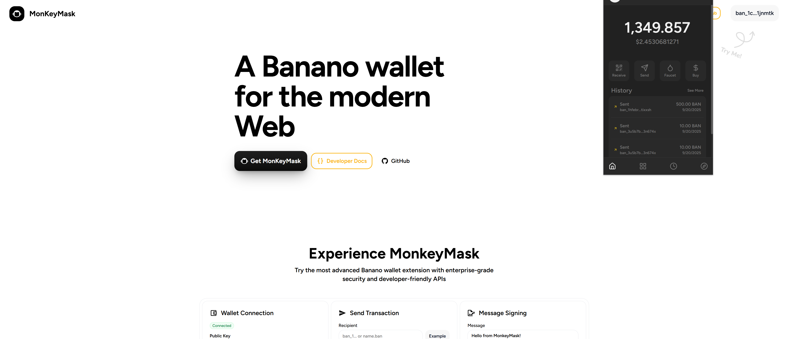

# MonkeyMask 🐒



**A secure, modern browser extension wallet for Banano cryptocurrency**

MonkeyMask brings the power of Banano to your browser with a user-friendly interface and developer-friendly API. Built with security, usability, and developer experience in mind.

## 🌟 Features

- **🔐 Secure Wallet Management**: HD wallet generation, encrypted local storage, and configurable auto-lock
- **🌐 dApp Integration**: Modern API following Solana wallet adapter and Phantom wallet patterns
- **🔓 Smart Locking**: Stay connected to dApps even when locked - unlock automatically for transactions
- **🎯 User-Friendly**: Intuitive popup interface with transaction approval flows
- **🛠️ Developer Ready**: Complete dApp template and comprehensive documentation
- **🏷️ BNS Support**: Built-in Banano Name System resolution (username.ban addresses)

## 📁 Project Structure

```
monkeymask/
├── extension/          # Browser extension (Chrome/Edge/Firefox)
├── dapp-template/      # Next.js dApp template for developers
└── README.md          # This file
```

## 🚀 Quick Start

### Extension Installation

1. **Clone the repository**
   ```bash
   git clone https://github.com/your-username/monkeymask.git
   cd monkeymask/extension
   ```

2. **Install dependencies**
   ```bash
   npm install
   ```

3. **Build the extension**
   ```bash
   npm run build
   ```

4. **Load in browser**
   - Open Chrome/Edge and go to `chrome://extensions/`
   - Enable "Developer mode"
   - Click "Load unpacked" and select the `extension/dist` folder
   - MonkeyMask will appear in your extensions toolbar

### dApp Template Usage

1. **Navigate to template**
   ```bash
   cd dapp-template
   ```

2. **Install dependencies**
   ```bash
   npm install
   ```

3. **Start development server**
   ```bash
   npm run dev
   ```

4. **Open in browser**
   - Visit `http://localhost:3000`
   - Connect your MonkeyMask extension
   - Explore the API examples and documentation

## 🔧 Development

### Extension Development
```bash
cd extension
npm run dev    # Development build with watch mode
npm run build  # Production build
npm test       # Run tests (if available)
```

### dApp Template Development
```bash
cd dapp-template
npm run dev        # Start Next.js dev server
npm run build      # Build for production
npm run start      # Start production server
npm run lint       # Run ESLint
```

## 📚 Documentation

- **Extension**: See `extension/README.md` for detailed setup and architecture
- **dApp Template**: See `dapp-template/README.md` and `dapp-template/INTEGRATION_GUIDE.md`
- **Quick Start**: See `dapp-template/GETTING_STARTED.md` for API usage examples

## 🏗️ Architecture

### Extension Components
- **Background Script**: Core wallet logic, RPC communication, approval flows
- **Popup UI**: React-based interface for wallet management and transaction approval
- **Content Script**: Injects provider API into web pages for dApp communication
- **Wallet Manager**: Encrypted storage, HD wallet generation, transaction signing

### dApp Integration
- **Provider API**: `window.banano` object with methods for connection, transactions, and signing
- **Event System**: Real-time updates for connection state, account changes, and disconnections
- **Smart Timeouts**: 15-minute timeouts for approval operations, 30 seconds for account queries
- **BNS Resolution**: Automatic conversion of .ban/.banano names to addresses

## 🔐 Security Features

- **Encrypted Storage**: All private keys encrypted with user password using AES-256
- **HD Wallet**: BIP-39 mnemonic generation with BIP-44 derivation paths
- **Permission System**: Per-origin permissions with easy revocation
- **Auto-Lock**: Configurable inactivity timeout (default 15 minutes)
- **Approval Flows**: Explicit user approval for all sensitive operations
- **Secure Communication**: Isolated content script with message passing

## 🎯 Smart Wallet Behavior

MonkeyMask features intelligent locking behavior that balances security with user experience:

**✅ Always Available (even when locked):**
- Connection to dApps
- Balance queries
- Account information
- BNS resolution

**🔓 Requires Unlock:**
- Transaction sending
- Message signing
- Block signing
- Private key operations

When a locked wallet needs to perform a transaction, MonkeyMask automatically opens the unlock interface, then proceeds to the approval screen - no manual reconnection needed.

## 🌐 Browser Support

- ✅ Chrome/Chromium 88+
- ✅ Microsoft Edge 88+
- ✅ Firefox 78+ (with manifest v2 compatibility)
- ✅ Brave Browser
- ✅ Opera

## 🤝 Contributing

1. Fork the repository
2. Create a feature branch (`git checkout -b feature/amazing-feature`)
3. Make your changes
4. Test thoroughly with both extension and dApp template
5. Commit your changes (`git commit -m 'Add amazing feature'`)
6. Push to the branch (`git push origin feature/amazing-feature`)
7. Open a Pull Request

## 📄 License

This project is licensed under the MIT License - see the [LICENSE](LICENSE) file for details.

## 🙏 Acknowledgments

- **Banano Community** for the amazing cryptocurrency and ecosystem
- **Solana Wallet Adapter** for the clean wallet integration patterns
- **Phantom Wallet** for the excellent UX and API design inspiration
- **Solana Ecosystem** for pioneering user-friendly wallet standards

---

**Ready to build with Banano? Start with the dApp template and join the MonkeyMask ecosystem! 🐒💛**
